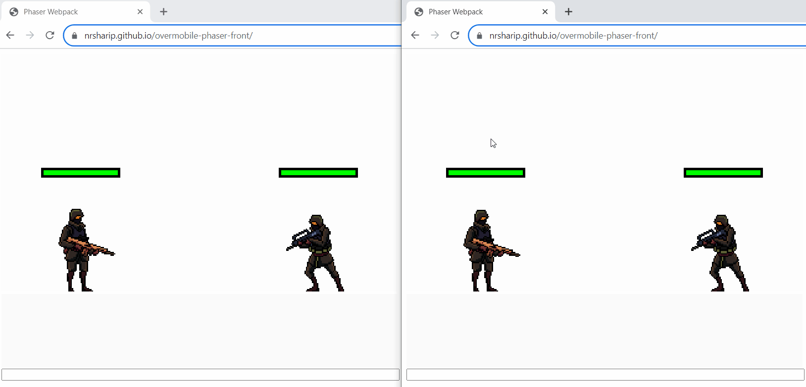
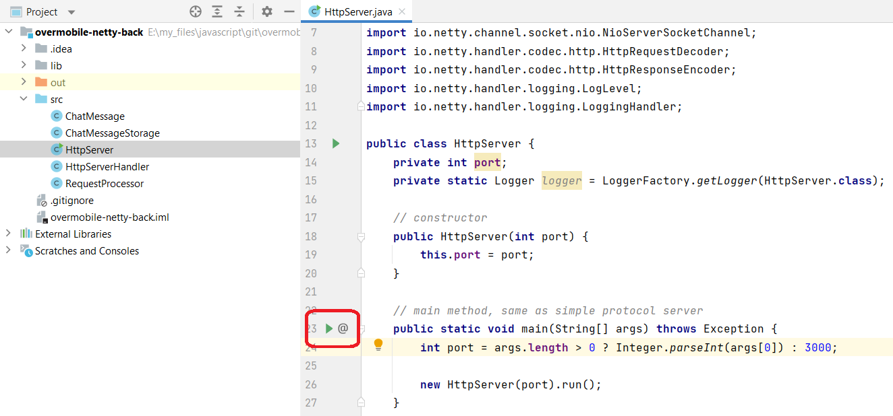

# Демонстрация

https://nrsharip.github.io/om-phaser-front/

# Скриншоты



# Инструкция

1. Клонировать Frontend

   ```
   git clone https://github.com/nrsharip/om-phaser-front.git
   ```
2. Клонировать Backend

   ```
   git clone https://github.com/nrsharip/om-netty-back.git
   ```
3. Запустить Backend в IntelliJ IDEA

   

5. Перейти в папку с Frontend

   ```
   cd overmobile-phaser-front
   ```

6. Запустить 'npm install'

   ```
   npm install
   ```
7. (1я вкладка в браузере) Запустить 'npm start'

   ```
   npm start
   ```

8. (2я вкладка в браузере) Либо запустить демо с Github Pages

   https://nrsharip.github.io/om-phaser-front/

9. Написать сообщения в чат

10. Нажать 'Новый бой' после завершения игры


# Игровые ресурсы

- [FREE SOLDIER SPRITE SHEETS PIXEL ART](https://craftpix.net/freebies/free-soldier-sprite-sheets-pixel-art/)
- [FREE RAIDER SPRITE SHEETS PIXEL ART](https://craftpix.net/freebies/free-raider-sprite-sheets-pixel-art/)
- [FREE GUNS PACK 2 FOR MAIN CHARACTERS PIXEL ART](https://craftpix.net/freebies/free-guns-pack-2-for-main-characters-pixel-art/)
- [FREE GUNS FOR CYBERPUNK CHARACTERS PIXEL ART](https://craftpix.net/freebies/free-guns-for-cyberpunk-characters-pixel-art/)
- [Male Death #2](https://freesound.org/people/AUDACITIER/sounds/632243/)
- [Male Death Sound](https://freesound.org/people/HighPixel/sounds/554443/)
- [357 Magnum Revolver Gunshot](https://freesound.org/people/Shark_Anthony/sounds/683186/)
- [pistol2.mp3](https://freesound.org/people/senitiel/sounds/220612/)
- [UI Pack](https://kenney.nl/assets/ui-pack)

## Installation

Ensure you have [Node.js](https://nodejs.org) installed.

Clone this repository and `cd` to project directory.

```
npm i
```

## Tasks

### Run the development server

```
npm start
```

Preview locally at http://localhost:8080/.

### Create a production build

```
npm run build
```

This bundles your files to the distribution (`/dist`) folder. The webpack config is set up to output Phaser and your game code into separate .js files.

_If you are publishing your game to [itch.io](https://itch.io) simply zip up the files in the `/dist` folder and upload the zip file._

## Community

This repository is actively maintained. Every so often I upgrade the packages and add features. I like boilerplates to be light so I have kept it minimal. But if you think this package would benefit from additional features then feel free to reach out or add an issue.
